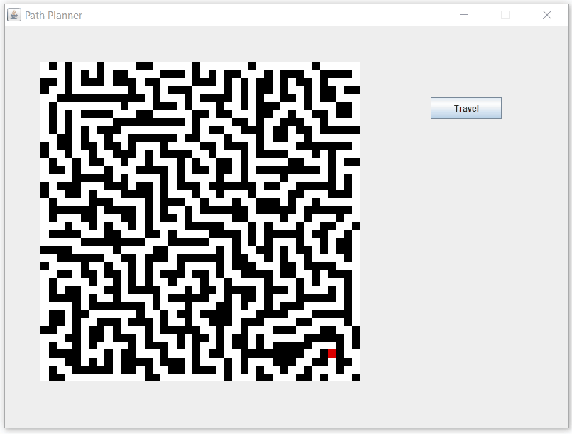

# PathPlanner
A Djikstra's algorithm visualizer! The color spectrum represents the distance from each point on the map to the starting point (red if unreachable). The program animates the shortest path it takes to get from point A to point B.

Point A, Point B, map obstacles, and the moving object are all customizeable!

Maze-solving:

Large object moving through randomly generated obstacles:
.gif)
